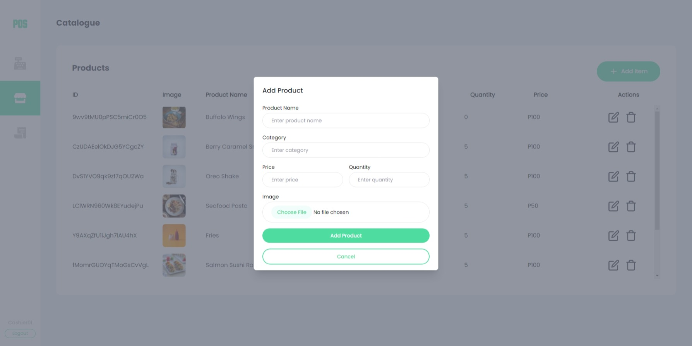

# POS App

A simple POS app made with NextJS for a course in CIIT

## Members

- [Nadji Tan](https://github.com/nadjitan) (nadjitan) - Frontend & Backend
- [Jeremy Habal](https://github.com/J-Habal) (J-Habal) - UI/UX Designer

## Sample Images

  
  
  
  
  

